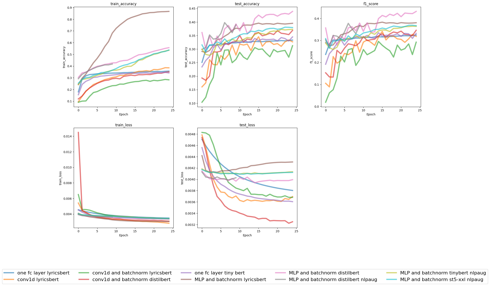

# nlp-mc-1

## Objective

As part of my 5th semester project, 49985 songs have been classified with a list of genres pertaining to the artist of the particular song. For each song and their artist(s) there exists some meta data. The objective is to classify the correct genre(s) of each song based on their lyrics since crawling the lyrics of those songs was a big task in the project. More meta data exists for the particular song (Spotify API and additional data from the project) that can be used for improving classification. This meta data will not be included in the classification in the first step. 

## Preprocessing

The lyrics have already been cleaned from non alphanumeric characters. The cleanup can be seen in the following figure: 

The preprocessing in [preprocess.ipynb](./notebooks/preprocess.ipynb) is aimed towards simplifying genre classification by reducing the total number of classes to N = 10 by using the most common word in a list of genres.

## Using TF-IDF and linear SVC

Term Frequency Inverse Document Frequency is a technique to quantify the importance of a term in a document. In our example, the documents talked about in TF-IDF theory, are the song lyrics. TF-IDF gives more weight to terms that are important but occur rarely in the corpus as a whole. Terms that occur frequently in one document but also occur frequently in all of the documents are seen as less important.

First, the term frequency of each term is calculated for each document. Then, the document frequency is calcuated which is how many times the term is seen over all documents. The logarithm is applied as such: log ( number of documents / document-frequency ) to give rare terms a higher score. Then, for each document, the final TF-IDF is calculated using the previously calculated log of inverse document frequency multiplied by the term frequency.

This matrix is given to the LinearSVC as input. It produces a linear support vector machine model that fits the data.
LinearSVC finds a hyperplane that separates the data into the specific classes (in our case song genres). 

In [simpler_models.ipynb](./notebooks/simpler_models.ipynb), I used a Pipeline using scikit learns FeatureUnion to calculated different TF-IDF vectorizers. I understood this as calculating multiple matrices with different TF-IDF hyperparameters and feeding all of that into a LinearSVC(). This effectively augments the data. The hyperparameters are the n-gram range. This means the matrices considers consecutive words as one single term. How many consecutive words are considered is the n in the n-gram. For example, "ngram_range=(1, 2)" would consider both unigrams and bigrams.

The model doesn't show a very good result which will be discussed in ## Results.

## BERT + Pytorch

In a second step, I stepped away from TF-IDF and used a pretrained BERT tokenizer and put the lyrics through a BERT model. The output is a encoded vector of the lyrics. The output is then passed to a neural network for classification. Multiple Neural Networks and BERT models were tested and accuracies + f1-scores are discussed in *Results*. 

BERT (Bidirectional Encoder Representations from Transformers) is a neural network architecture that was introduced in 2018 by Google researchers. It is a pre-trained transformer-based model that is trained on large amounts of text data to create embeddings, which can then be fine-tuned on specific tasks, such as text classification or question-answering. The core of BERT is a transformer, which is a type of neural network that processes sequential data, such as text. Unlike traditional sequential models, transformers are designed to allow for parallel processing of the input sequence, making them much faster and more efficient. Transformers work by breaking the input sequence into smaller chunks called "tokens", and then processing each token in parallel. In bERT the words are also tokenized based on their frequencies. In the BERT models used in this project, one was pretrained using Contrastive Learning on song lyrics data and named lyrics-bert. It is very small compared to other models. Therefore, the baseline distilbert-base-uncased shows a bit better results. 

## Results

In the plot for the model training history we can see a couple of things: 

 

We can see that all the models fail to reach a test accuracy of over 45%. Same for the f1-score. The best model is the MLP with batchnormalization using distilbert-base-uncased. The models with lyricsbert were slightly worse but that's also because this model is 3 times smaller than distilbert-base-uncased. The train_accuracy on the top left overfits pretty fast with MLP models. The test_accuracy plot next to the train_accuracy one shows that it's truly overfitting without making the test_accuracy much better. Which embedding model used is not that important, because the accuracy stays low. We can only see that the convolution networks weren't that good. Maybe different batch sizes and learning rates would have changed the outcome, but we can also assume that the accuracies wouldn't have improved by a lot. The (test) f1 score behaves almost identically to the test_accuracy. For the train and test loss at the bnottom, we can see that for the train losses, the models converge very quickly and for the test_losses it seems as if some of the models could still improve for a couple of steps. We can see that the models that overfit on the train accuracy, actually converge the fastest in the test_loss. it's also interesting to note that the models with one single fully connected layer perform better than the MLP ones with more layers. 

For the simpler models using Tf-IDF and Support Vector Machines, the accuracies and f1-scores look very similar. We can assume that changing the way we process the texts into tokens don't improve the models too much. If we look at the confusion matrices, the way to go seems to be augmenting the data, getting more data, maybe few-shot learning and tackling the problem of class imbalance. The models that used the library nlpaug for data augmentation didn't show better results, but they weren't trained for a long time, where the data augmentation could actually make a difference. To improve, more data can be crawled or models suited for class imbalance can be used.

In the confusion matrix we can see that the SVC shows very similar results to all embedding models. They all predict rock and pop (and maybe hiphop) the most even if it's not correct. The better ones make more evenly distributed bad predictions. Rock and pop are the two most common occuring classes so it makes sense that bad predictions fall into either rock or pop.

## More text processing

In [text_processing.ipynb](./notebooks/text_processing.ipynb), the classification performance was tested when deleting contractions, using lemmatization (reducing words to their stem word ("running" to "run")), deleting stopwords, and combining all of these techniques. No improvements could be observed.
